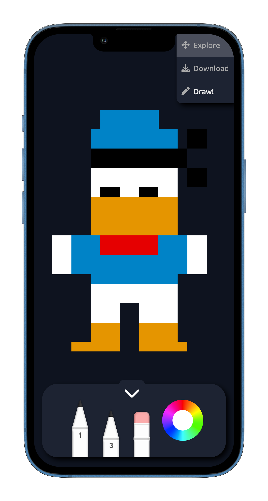

# Example: Artwall

The Artwall (see [artwall.unyt.org](https://artwall.unyt.org)) is a collaborative art project for unyt.org trade shows and events. 

The project is about creating a **joint digital artwork with strangers**.

In a transparent canvas each participant can color the pixels of a certain own area (*30x30*) with a 16-color palette.

The repository implements [front-end](https://unyt.org/glossary#front-end) rendering.

## Installation
1. Install the **UIX command line tool** following the [Getting Started](https://docs.unyt.org/manual/uix/getting-started#the-uix-command-line-tool) guide in our documentation.

2. Clone this repository to your local machine:

	```bash
	$ git clone https://github.com/unyt-org/example-artwall
	```
3. Run the project local
	```bash
	$ uix -wlb --port 8000
	```
4. Navigate to your favourite web browser and open http://localhost:8000 to see everything in action. 

## Structure
This diagram outlines the UIX default project structure.
We split our code base in [back-end](https://unyt.org/glossary#back-end), [front-end](https://unyt.org/glossary#front-end), and commons folder.
```
.
└── example-artwall/
    ├── backend/
    │   ├── .dx                 // Config file for deployment
    │   ├── Matrix.ts           // Artwall matrix storage
    │   ├── assets/             // Default assets
    │   └── entrypoint.tsx      // Back-end entrypoint
    ├── common/
    │   └── compoments/
    │       ├── res/            // Front-end assets
    │       ├── AreaHandler.ts  // Drawing area handler
    │       ├── Array2d.ts      // Custom DATEX type
    │       ├── DragTool.ts     // Drag tool class
    │       ├── DrawTool.ts     // Draw tool class
    │       ├── globals.ts      // Shared data class
    │       ├── map.dx          // Map file
    │       ├── Tool.ts         // Tool class
    │       ├── globals.ts      // Shared data class
    │       ├── GameView.scss   // Game style declaration
    │       ├── GameView.tsx    // Game component
    │       ├── Homepage.scss   // Homepage style declaration
    │       └── Homepage.tsx    // Homepage component
    ├── frontend/
    │   └── entrypoint.tsx      // Front-end entrypoint
    ├── app.dx                  // Endpoint config file
    └── deno.json               // Deno config file
```

## Features
* Multiplayer
* Area handling
* Artwall default images
* Artwall persistent storage

## Preview


## Explanation
### Concept of Pointers
In [UIX](https://uix.unyt.org), [Pointers](https://unyt.org/glossary#pointer) are a fundamental concept for managing shared data across different parts of your application. Pointers allow different components or [endpoints](https://unyt.org/glossary#endpoint) to access and modify the same data. In the context of our game, a Pointer could represent the x,y and value of a pixel.

Pointers are synchronized over the [Supranet](https://unyt.org/glossary#supranet), based on our powerful [DATEX](https://datex.unyt.org) networking protocol that ensures real-time updates and consistency across endpoints. When one user draws a pixel, the changes are propagated to the other players through the Supranet, keeping the game state in sync.

---

<sub>&copy; unyt 2023 • [unyt.org](https://unyt.org)</sub>